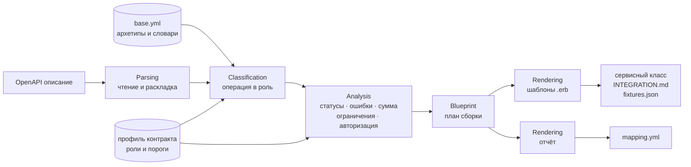

<p align="center">
  
</p>

<p align="center">
  
</p>

<p align="center">
  <strong>Генератор платёжных интеграций по описанию OpenAPI.</strong><br/>
  Читает API провайдера, распознаёт роли операций и собирает готовый сервисный класс под контракт заказчика — объясняя каждое решение правилом.
</p>

<p align="center">
  <a href="#как-работает">Как работает</a>
  &nbsp;·&nbsp;
  <a href="#быстрый-старт">Быстрый старт</a>
  &nbsp;·&nbsp;
  <a href="#витрина">Витрина</a>
</p>

<p align="center">
  
  
  
  
  
</p>

> Нейросетей внутри нет. Каждое решение принято правилом из YAML-файла, и в `mapping.yml` рядом с результатом видно, какие именно правила сработали и с каким счётом.

## Суть

У каждого платёжного провайдера свой API. Одно и то же называется по-разному: где `createPayout`, там `submitTransfer`; где сумма в рублях строкой, там в копейках числом; где `SUCCEEDED`, там `completed`. Интеграция пишется руками неделю и содержит одни и те же ошибки — перепутанные единицы суммы, недоучтённые статусы, необработанные коды ошибок, неверно определённая повторяемость отказа.

RSOCKET читает описание API в формате OpenAPI и собирает по нему готовую интеграцию под контракт заказчика: сервисный класс на Ruby, инструкцию по подключению, набор примеров запросов и ответов и файл разбора. Инструмент сам разбирается, какая операция создаёт платёж, какая отдаёт статус, какие состояния провайдера означают успех, что делать при каждой ошибке, — и честно перечисляет то, в чём не уверен.

## Как работает

Конвейер стадий: описание читается и раскладывается в общий вид, операции получают роли по взвешенным правилам, из ролей выводятся статусы, ошибки, единицы суммы и авторизация, и всё это печатается по шаблонам профиля контракта.



1. **Чтение** — `parsing/` разбирает OpenAPI, разрешает `$ref` и раскладывает операции, схемы и параметры в общий вид.
2. **Распознавание** — `classification/` считает счёт каждой операции по каждой роли: поле операции, регулярка по нему и вес. Роль занимает операция, перешагнувшая порог профиля.
3. **Вывод** — `analysis/` достаёт из схем состояния и переводит их в термины контракта, размечает ошибки по смыслу и повторяемости, определяет единицы суммы, ограничения, способ авторизации и собирает примеры.
4. **Печать** — `rendering/` подставляет план в шаблоны `.erb` профиля и параллельно пишет отчёт `mapping.yml`.

Если обязательная роль осталась незанятой, сборка останавливается с ошибкой, а не выдаёт молча неполный класс.

## Два слоя правил

Правила разделены на два слоя, и это главное решение проекта.

**Первый слой — [`app/config/rules/base.yml`](app/config/rules/base.yml): как чужие API называют одно и то же.** Архетипы операций (создание, запрос статуса, обработка уведомления, отмена), словари состояний, смыслы ошибок, варианты написания полей и заголовков, единицы суммы. Правило — это поле операции, регулярка по нему и вес. Веса нужны, чтобы слабый признак (метод `POST`) не перевешивал сильный (глагол в начале `operationId`); `veto` снимает кандидата целиком — без него `cancelPayout` выигрывал бы архетип создания, потому что это `POST` со словом `payout` в имени.

В этом файле нет ни одного имени метода заказчика, ни одного выражения на Ruby. Новый вариант написания `operationId` добавляется правкой одной строки — сразу для всех контрактов.

**Второй слой — профиль контракта в [`app/config/rules/contracts/`](app/config/rules/contracts/): под какой интерфейс собираем.** Имена ролей (они же имена методов), пороги счёта, обязательность ролей, перевод состояний в термины заказчика, коды ошибок и действия по ним, выражения на Ruby, которыми обёртка достаёт данные, и шаблоны `.erb` выходных файлов. Профиль ссылается на архетипы и группы из `base.yml` по именам.

| Профиль | Интерфейс | Роли |
|---|---|---|
| `space_payments` | класс наследуется от `Provider::BaseService`, отвечает Result-объектами через `success`/`failure` | `create_request`, `fetch_status`, `process_callback`, `cancel_request` |
| `plain_client` | класс ни от кого не наследуется, платёж принимает хешем, успех возвращает значением, отказ поднимает исключением | `send_payout`, `payout_state`, `read_callback`, `cancel_payout` |

Интерфейсы у них разные до несовместимости, роли называются по-разному, а правила распознавания чужого API — одни и те же. На одном и том же описании NovaPay:

```
контракт: space_payments              контракт: plain_client
  create_request     POST /payouts      send_payout      POST /payouts
  fetch_status       GET  /payouts/…    payout_state     GET  /payouts/…
  process_callback   POST /webhooks/…   read_callback    POST /webhooks/…
  cancel_request     POST /payouts/…    cancel_payout    POST /payouts/…
```

Это и есть доказательство, что решение не привязано к одному интерфейсу: под новый контракт заказчика пишется профиль, а разбор чужих API не трогается. Новый профиль создаётся записью его файлов — командой `push` или ручкой `PUT /rules/contracts/<имя>/<файл>`.

## Быстрый старт

Ruby на машине не нужен — всё внутри образа.

```bash
docker compose up -d --wait
```

Поднимается три вещи: MinIO как S3-хранилище, разовый шаг `rules` (переносит локальные правила в бакет) и сам сервер на `127.0.0.1:9292`.

```bash
curl http://127.0.0.1:9292/health
```

```json
{
  "status": "ok",
  "rules": "s3://rsocket/rules",
  "contracts": [
    "plain_client",
    "space_payments"
  ]
}
```

Сборка интеграции одной командой:

```bash
docker compose run --rm rsocket \
  bundle exec bin/rsocket build -s examples/novapay/provider_api.yaml -p novapay -o output
```

```
контракт: space_payments
  create_request     POST /payouts
  fetch_status       GET /payouts/{payout_id}
  process_callback   POST /webhooks/payout
  cancel_request     POST /payouts/{payout_id}/cancel
  ! сумма провайдера: amount (integer), единицы: копейки
  ! подпись приходит в заголовке X-NovaPay-Signature

  output/novapay/novapay_service.rb
  output/novapay/INTEGRATION.md
  output/novapay/fixtures.json
  output/novapay/mapping.yml
```

Каталог `output/` смонтирован с хоста, поэтому файлы сразу лежат рядом с репозиторием. Строки с `!` — это не ошибки, а решения, которые стоит проверить глазами. Остановить: `docker compose down`.

<details>
<summary>Без Docker, если Ruby на машине есть</summary>

Версия — из [`.ruby-version`](.ruby-version), сейчас **3.3.12**.

```bash
bundle install
bundle exec bin/rsocket build -s examples/novapay/provider_api.yaml -p novapay -o output
```

Командная строка по умолчанию работает локально: правила читает из `app/config/rules/`, результат кладёт в `output/<провайдер>/`. Ни S3, ни MinIO ей не нужны. Сервер локально, тоже без S3: `bundle exec bin/rsocket serve --storage local`.

</details>

## Что на выходе

Файлы кладутся в `output/<провайдер>/` — или в `s3://<бакет>/output/<провайдер>/`, если работа идёт через S3.

| Файл | Что внутри |
|---|---|
| `<провайдер>_service.rb` | сервисный класс: методы по ролям контракта, HTTP-вызовы, перевод состояний, разбор ошибок, проверка ограничений, подпись запросов |
| `INTEGRATION.md` | инструкция: какие переменные окружения задать, как авторизоваться, какие методы есть, что делать при каждой ошибке |
| `fixtures.json` | примеры запросов и ответов по каждой роли, собранные из схем описания |
| `mapping.yml` | разбор: какая операция какую роль заняла, с каким счётом при каком пороге, какие правила сработали, как переведены статусы |

Имя первого файла задаёт профиль контракта: под `space_payments` это `<провайдер>_service.rb`, под `plain_client` — `<провайдер>_client.rb`.

`mapping.yml` читается человеком:

```yaml
provider: novapay
contract: space_payments
spec: examples/novapay/provider_api.yaml
api: NovaPay Payout API 1.0.0
base_url: https://api.sandbox.novapay.example/v1
roles:
  create_request:
    status: запрос к провайдеру
    operation: create_payout
    endpoint: POST /payouts
    score: 15
    threshold: 10
    matched_rules:
    - operation_id =~ /\A(create|make|submit|send|issue|register|open|start|initiate|new)/
    - operation_id =~ /(payout|payment|transfer|deposit|order|withdraw|charge)/
    - http_method =~ /\Apost\z/
```

Если роль назначена неверно, правятся правила и делается пересборка — сам файл результата править бесполезно, следующий прогон его затрёт.

## CLI

| Команда | Что делает |
|---|---|
| `build` | собирает интеграцию по описанию провайдера |
| `serve` | поднимает HTTP-сервер: те же сборки, но по HTTP |
| `push` | переносит локальные правила и шаблоны в S3 |
| `contracts` | показывает профили контрактов, под которые можно собирать |
| `doctor` | показывает правила, по которым инструмент разбирает описания |
| `help` | список команд и флаги |

Флаги `build`:

| Флаг | Что задаёт |
|---|---|
| `-s`, `--spec` | путь к OpenAPI-описанию, обязателен |
| `-p`, `--provider` | имя провайдера, обязателен; из него берутся имена класса, файлов и переменных окружения |
| `-o`, `--out` | каталог результата при локальном хранилище, по умолчанию `output` |
| `-c`, `--contract` | профиль контракта, по умолчанию `space_payments` |
| `--storage` | `local` или `s3` |

Имя провайдера участвует в именах: `novapay` → класс `NovapayService`, файл `novapay_service.rb`, переменные `NOVAPAY_*`.

`doctor` показывает, какие роли профиль ищет, с каким порогом и сколько правил на каждую:

```
контракт: space_payments — контракт Space Payments (Provider::BaseService)
правила:  локальный каталог /app/app/config/rules
  create_request     порог 10, обязательна,    правил: 5, calls_provider creates_operation
  fetch_status       порог  8, обязательна,    правил: 4, calls_provider
  process_callback   порог  8, необязательна,  правил: 4, receives_callback
  cancel_request     порог  8, необязательна,  правил: 4, calls_provider
```

## HTTP API

Тот же инструмент, что и в командной строке, только по HTTP: сервер разбирает запрос, зовёт тот же менеджер сборок и печатает результат JSON-ом. `bin/rsocket build` и `POST /build` на одном описании дают одинаковые файлы.

| Ручка | Что делает |
|---|---|
| `GET /` | что умеет сервис |
| `GET /health` | жив ли он и какие профили видит |
| `GET /openapi.yaml` | собственное описание сервиса |
| `GET /contracts` | профили контрактов, их файлы и роли |
| `GET /rules`, `GET /rules/<ключ>` | что лежит в хранилище правил и содержимое файла |
| `PUT /rules/<ключ>` | записать правила или шаблон |
| `POST /build` | сборка: описание в теле, `?provider=имя[&contract=профиль]` |

```bash
curl -X POST "http://127.0.0.1:9292/build?provider=novapay" \
     --data-binary @examples/novapay/provider_api.yaml
```

Правила читаются на каждый запрос, поэтому правка через `PUT /rules/<ключ>` действует немедленно — пересобирать ничего не нужно.

Подробно, с примерами ответов и таблицей переменных окружения, — [`docs/http-api.md`](docs/http-api.md). Машиночитаемое описание — [`docs/openapi.yaml`](docs/openapi.yaml), сервис отдаёт его и сам.

## Витрина

Как инструмент разбирает чужое описание — видно вживую: операции разбегаются по ролям, у каждой видно счёт, порог и сработавшие правила, а каждая строка собранного сервиса связана с решением, из которого выросла.

Адрес: **ЗАПОЛНИТЬ ПОСЛЕ ВЫКЛАДКИ**

| Страница | Что показывает |
|---|---|
| Начало | что инструмент делает и на чём это видно |
| Разбор | прогон по шагам: операции, счёт, порог, сработавшие правила |
| Правила | оба слоя правил с песочницей |
| Провайдеры | четыре описания рядом, разобранные одними правилами |
| Документация | CLI и HTTP API |

Своё описание можно подсунуть прямо на сайте — оно уходит в настоящий `POST /build`; без сервера сайт тоже работает, разборы запечены в сборку.

Исходники витрины — в каталоге [`web/`](web/). Это отдельная от решения часть: на решение кейса она не влияет и ни один Ruby-файл от неё не зависит. Как запустить — [`web/README.md`](web/README.md), как развернуть — [`web/infra/DEPLOY.md`](web/infra/DEPLOY.md).

<p align="center">
  <strong>Описание на входе. Работающая интеграция на выходе. Правило за каждым решением.</strong><br/>
  <sub>Без нейросетей. Всё объяснимо.</sub>
</p>
