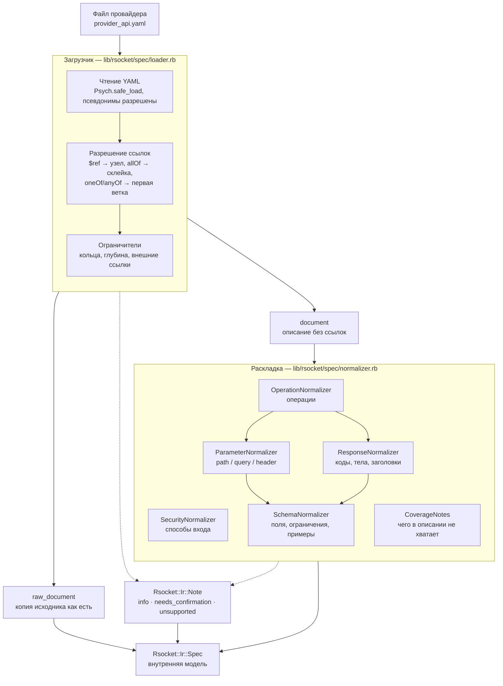

# Как устроен вход: от файла с описанием API до внутренней модели

Это первая из четырёх частей инструмента. Её работа: взять файл провайдера в формате
OpenAPI и превратить его в структуру данных, с которой дальше работают распознавание,
генерация и проверка. Ни одна из следующих частей не заглядывает в YAML — они видят
только внутреннюю модель.

Ключевое требование к этой части не «разобрать как можно больше», а **разобрать
честно**. Описание, которое приносит реальный банк, почти всегда неполное: где-то не
описаны ошибки, где-то нет ни одного примера, где-то требование записано словами в
тексте, а не в структуре. Инструмент, который в таких местах додумывает, опаснее
инструмента, который отказывается работать: додуманное всплывёт в проде. Поэтому вход
устроен так, что всё непонятое становится записью в отчёте, а не молчаливым
предположением.

## Схема



Пунктиром показан второй поток: заметки о непонятом. Он идёт через обе стадии и
приходит в ту же модель, что и разобранные данные. Отчёт инструмента — не побочный
вывод, а часть результата.

## Загрузчик

`lib/rsocket/spec/loader.rb`. Отвечает на вопрос «что вообще написано в файле» и не
знает ничего про платежи.

**Чтение.** `Psych.safe_load` с разрешёнными псевдонимами: якоря `&` и ссылки `*` —
обычный приём в рукописных YAML, и ломаться на них нельзя. Небезопасные типы YAML
запрещены — файл провайдера не должен уметь создавать объекты Ruby.

**Разрешение локальных ссылок.** `$ref` вида `#/components/schemas/Recipient`
заменяется содержимым узла, в любом месте документа. Если рядом с `$ref` лежат другие
ключи (так пишут, чтобы уточнить `description`), они накладываются поверх цели.

**Склейка `allOf`.** Ветки сливаются в одну схему; списки `required` из всех веток
объединяются, а не затираются последним. Иначе половина обязательных полей исчезает.

**Развилка `oneOf` и `anyOf`.** Берётся первая ветка, и пишется заметка уровня
«требует подтверждения» с точным местом развилки. Выбрать ветку молча нельзя: у
провайдера это обычно «перевод по реквизитам или на карту», то есть два разных набора
обязательных полей.

**Ограничители.** Кольцевая ссылка (`A` → `B` → `A`) обрывается с понятным сообщением,
в котором видна вся цепочка. Кольцевая структура самого YAML ловится отдельно, по
объектам, а не по ссылкам. Глубина вложенности ссылок ограничена, предел задаётся
параметром, а не константой в коде.

**Внешние ссылки** — на другой файл или на `http` — не поддерживаются. Узел остаётся в
документе как есть, пишется заметка уровня «не поддержано», работа продолжается.

Результат загрузчика — три вещи: `document` (описание с раскрытыми ссылками),
`raw_document` (копия исходника, нужна генератору примеров данных) и список заметок.

**Ошибки разбора — отдельная работа, а не побочный эффект.** Никаких трассировок стека
в лицо пользователю: битый YAML называет строку и столбец, пустой файл, отсутствующий
раздел `paths`, ссылка в никуда, отсутствие файла и нехватка прав — у каждого случая
своё сообщение с указанием места.

## Почему разрешение ссылок написано своими руками

Готовые гемы-парсеры OpenAPI сначала проверяют описание на соответствие стандарту и
только потом отдают данные. Наша стратегия ровно обратная: **прощать и честно сообщать
о непонятом**. Описание, которое приносит настоящий банк, строгий парсер скорее
отвергнет целиком, чем разберёт наполовину, — а наполовину разобранное описание плюс
список вопросов человеку полезнее, чем отказ.

Своё написанное сверху ограничено по объёму (обход дерева, склейка, четыре
ограничителя) и спрятано за собственным интерфейсом, поэтому подмена на гем остаётся
дешёвой, если своё окажется недостаточным. Решение и его обоснование записаны в
[../context/30-decisions.md](../context/30-decisions.md).

## Раскладка

`lib/rsocket/spec/normalizer.rb` и четыре помощника рядом. Отвечает на вопрос «что из
написанного нам пригодится» и раскладывает это по классам модели.

Раскладка разбита по видам данных, а не одним большим классом, по трём причинам.

Первая: правила разбора **поля** одни и те же, откуда бы поле ни пришло — из тела
запроса, из параметра в адресе, из тела ответа или из заголовка ответа. `SchemaNormalizer`
один на всех, и если правило меняется, оно меняется в одном месте.

Вторая: у каждого вида данных свои особенности, и они не должны мешать друг другу.
Обязательность параметра лежит в самом параметре, а обязательность поля тела — в списке
`required` родительского объекта. Код ответа бывает числом, а бывает словом `default`.
Способ входа объявляется в одном месте, а требуется в другом. Смешать это в одном методе
можно, но читать станет нельзя.

Третья, и на этом хакатоне главная: универсальность решения жюри оценивает **чтением
кода**. Классы по 30–60 строк с говорящими именами показывают с первого взгляда, что
механизм общий и ни под какого провайдера не заточен. Большой метод с ветвлениями этого
показать не может, даже если он тоже общий.

Что делают помощники:

- `SchemaNormalizer` — схема в список полей. Рекурсивно, с полным путём через точку
  (`recipient.phone`), с ограничениями (`enum`, `pattern`, `minimum`, `maxLength`), с
  примерами из `examples` и из `example` — провайдеры пишут и так, и так.
- `ParameterNormalizer` — параметры пути, строки запроса и заголовков. Параметры
  уровня пути объединяются с параметрами операции, при совпадении имени побеждает
  операция.
- `ResponseNormalizer` — ответы: код, описание, поля тела, примеры, заголовки.
- `SecurityNormalizer` — объявленные способы входа и то, какие из них требуются каждой
  операции.
- `CoverageNotes` — не разбирает ничего, а проверяет разобранное на дыры: операции без
  единого примера и операции без единого описанного отказа.

## Внутренняя модель

`lib/rsocket/ir/`. Это договорённость между тремя направлениями работы: вход её
производит, распознавание и генерация потребляют.

| Класс | Назначение |
|---|---|
| `Ir::Spec` | всё описание целиком: заголовок, версия, серверы, способы входа, операции, исходные схемы, заметки |
| `Ir::Server` | адрес и среда: `:sandbox`, `:production` или `:unknown` |
| `Ir::SecurityScheme` | способ входа: вид, место (заголовок, строка запроса, cookie), имя |
| `Ir::Operation` | одна операция: метод, путь, идентификатор, параметры, поля запроса, ответы, требования ко входу |
| `Ir::Response` | один ответ: код, описание, поля тела, примеры, заголовки |
| `Ir::Field` | одно поле: тип, формат, обязательность, ограничения, вложенные поля, полный путь |
| `Ir::Note` | одна заметка о непонятом: уровень, место, сообщение |

Главное свойство модели: **в ней нет ни одного названия провайдера**. Ни `novapay`, ни
`payouts`, ни `sbp` — ни в именах классов, ни в значениях по умолчанию, ни в константах.
Всё, что зависит от конкретного провайдера, живёт в словарях и шаблонах, и это правило
проверяется отдельным тестом, который ищет такие строки по всему `lib/` и падает при
находке.

Два места, где легко ошибиться и где модель специально различает похожее:

- **Пустой список требований ко входу и отсутствие требований — разные вещи.** Пустой
  список означает, что операция намеренно открыта (так помечают приём уведомлений).
  Отсутствие означает наследование общей настройки документа. А если во всём описании
  нет ни одной схемы входа, то пустой список не означает ничего — и на этот случай
  пишется заметка, чтобы «открытый API» не оказался нашей выдумкой.
- **Текстовые описания доходят до модели без потерь.** `description` у поля, операции,
  ответа и параметра не обрезается и не нормализуется. Часто это единственное место,
  где сказано, что сумма в копейках или что поле обязательно при определённом значении
  другого поля. Распознавание ищет признаки именно в этих текстах.

## Что происходит с непонятым

Заметка `Ir::Note` — это уровень, место и человекочитаемое сообщение. Уровня три:

- `:info` — разобрали, но стоит знать.
- `:needs_confirmation` — разобрали одним из возможных способов, человеку нужно
  подтвердить. Сюда попадают выбранная ветка `oneOf`, нераспознанный способ входа,
  описание без схем входа, операции без примеров и без описанных отказов.
- `:unsupported` — конструкцию знаем, но намеренно не поддерживаем. Сюда попадают
  внешние ссылки.

Все заметки складываются в `Ir::Spec#notes` — то есть попадают ровно туда же, куда и
разобранные данные, и дальше печатаются в отчёте прогона. Место записывается путём
внутри описания (`paths./payment-orders.post.responses`), чтобы человек открыл файл и
сразу нашёл нужную строку.

Правило простое: **инструмент либо разобрал, либо сказал, что не разобрал.** Третьего
состояния — «молча подставил что-то похожее» — нет.

## Таблица покрытия

Честно, без прикрас: список того, чего мы не делаем, — это описание границ, а не
признание слабости. Неизвестная граница опаснее известной.

| Конструкция OpenAPI | Как обходимся |
|---|---|
| OpenAPI 3.0 и 3.1 | обе; номер версии не влияет на разбор — мы читаем только те конструкции, которые в обеих версиях записываются одинаково |
| псевдонимы YAML (`&`, `*`) | разворачиваются |
| локальные `$ref` | разрешаются в любом месте документа, включая ссылку рядом с другими ключами |
| `allOf` | склеивается, списки `required` объединяются |
| `oneOf`, `anyOf` | берётся первая ветка, пишется заметка «требует подтверждения» |
| вложенные объекты и массивы | разбираются рекурсивно, у каждого поля полный путь через точку |
| `required` | берётся из объекта-родителя, а не из самого поля |
| `examples` и `example` | поддерживаются оба написания |
| несколько типов содержимого | берётся `application/json`, затем любой `*+json`, затем первый описанный |
| параметры пути и операции | объединяются, при совпадении имени побеждает операция |
| нечисловые коды ответа (`default`, `4XX`) | сохраняются как есть, строкой |
| заголовки ответа | разбираются как обычные поля |
| внешние `$ref` (другой файл, `http`) | **не поддерживаем**: узел остаётся как есть, заметка «не поддержано» |
| `discriminator` | **не поддерживаем**: ветка выбирается первая, как и для любого `oneOf` |
| `webhooks` верхнего уровня в 3.1 без раздела `paths` | **не поддерживаем**: описание отклоняется понятным сообщением |
| `callbacks`, `links` | **не поддерживаем**: игнорируются молча |
| `style` и `explode` у параметров | **не поддерживаем**: способ сериализации списков в строке запроса не учитывается |
| `not`, `additionalProperties` | **не поддерживаем**: игнорируются |
| `default`, `minLength`, `multipleOf` | **не поддерживаем**: в модель поля не попадают |
| `type` списком (`[string, "null"]` в 3.1) | сохраняется как есть; отдельного признака «может быть пустым» в модели нет |

## Как проверить руками

Четыре описания в `examples/` — это наша самопроверка, а не витрина. Каждое ломает своё
предположение: `novapay` — эталон организаторов, `swiftpay` — вход по токену и суммы
дробным числом, `kassabox` — версия 3.1, два способа входа и конверт вокруг ответа,
`nordbank` — ни одного описанного отказа, ни одного примера, отсутствующий раздел
`securitySchemes` при требовании ключа, записанном словами, и сумма строкой.

```
bundle exec bin/rsocket doctor
```

Команда читает и раскладывает все описания, какие лежат в `examples/`, и сообщает
количество. Добавленное описание попадает в проверку само, без правки кода.
