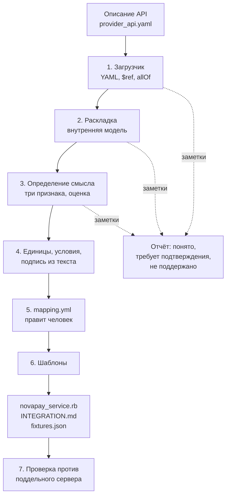

# Как работает решение

RSOCKET читает описание API платёжного провайдера и собирает заготовку интеграции:
сервис на Ruby по контракту заказчика, инструкцию по подключению и примеры данных для
тестов.

Документ описывает механику по шагам, на реальном примере. Более подробный разбор
первых двух шагов — в [input.md](input.md).

> **Что уже собрано, а что нет.** Шаги 1, 2 и 7 работают, покрыты тестами и запускаются.
> Шаги 3–6 в работе. В документе это помечено у каждого шага, чтобы не создавать
> впечатления, будто готово всё.

## Зачем это нужно

Подключение нового провайдера — два-пять дней ручной работы. Разработчик читает
документацию и пишет сервис с нуля. Работа однотипная, но не механическая: каждый раз
надо разобраться, какой метод создаёт выплату, что означают его статусы, какие ошибки
можно повторять, а какие окончательные.

Существующие генераторы вроде `openapi-generator` переводят схему в типизированные
методы и на этом останавливаются — они дают клиента к HTTP-API. Настоящая работа
начинается там, где они заканчиваются: понять, **какой** метод создаёт выплату, **какие**
статусы означают успех, **какие** ошибки имеет смысл повторить, в **каких** единицах
передаётся сумма, **как** проверяется подпись уведомления. Для этого нужно понимать
платёжный домен, а не только структуру схемы. Мы генерируем не клиента к HTTP-API, а
платёжную интеграцию.

## Конвейер



## Шаг 1. Читаем файл

*Собрано.*

Загрузчик читает YAML, разворачивает локальные ссылки `$ref` своим кодом, склеивает
`allOf`, у `oneOf` и `anyOf` берёт первую ветку и записывает заметку о развилке.
Кольцевые ссылки останавливает по глубине вложенности. Внешние файловые ссылки не
поддерживает, но не падает — пишет заметку.

Ошибки разбора человекочитаемы: битый YAML сообщает номер строки, пустой файл, документ
без раздела `paths`, ссылка в никуда, файл без прав на чтение — каждый случай даёт
понятное сообщение, а не след вызовов.

Почему разрешение ссылок написано своими руками, а не взят готовый гем: строгий
разборщик скорее откажется читать нестандартное описание, а наша стратегия — прощать и
честно сообщать о непонятом. Обоснование в
[../context/30-decisions.md](../context/30-decisions.md).

## Шаг 2. Раскладываем в модель

*Собрано.*

Сырая структура превращается во внутреннее представление: операции, поля с полными
путями, параметры, ответы, схемы авторизации, примеры. Реальный вывод на описании
NovaPay:

```
ОПЕРАЦИЯ: POST /payouts
operation_id: createPayout   tags: ["Payouts"]   security: ["ApiKeyAuth"]
поля тела запроса:
  amount        integer  required=true  min=100000
  currency      string   required=true
  external_id   string   required=true
  recipient     object   required=true
ответы: [201, 400, 401, 402, 409, 422, 429, 500]
поля ответа 201: id, external_id, status, amount, currency, recipient, error,
                 created_at, completed_at
```

Ключевое свойство: **дальше ни одна часть системы не знает, что это NovaPay**. Все
следующие шаги работают только с этой структурой. Названий конкретных провайдеров нет
нигде в `lib/`, кроме словарей и шаблонов — это проверяется отдельным тестом, который
падает при находке.

## Шаг 3. Определяем роль каждой операции

*В работе.*

В описании не написано «этот метод создаёт выплату» — у каждого провайдера свои имена.
Смысл определяется тремя независимыми признаками, работающими вместе. Каждый добавляет
очков, сумма сравнивается с порогом.

На операции `POST /payouts`:

| Источник | Что сработало | Очки |
|---|---|---|
| Словарь | `operation_id` содержит `payout`, тег `Payouts` | +0.3 |
| Форма | POST, в теле `amount` и `currency` и получатель, в ответе `id` и `status` | +0.5 |
| Связи | возвращает `id`, который принимается в пути `GET /payouts/{payout_id}` | +0.4 |

Сумма 1.2 при пороге 0.7 — роль `create_payout`, вердикт «уверен».

На `GET /payouts/{payout_id}`: тела запроса нет, есть параметр в пути, в ответе `status`
— роль `fetch_status`.

**Зачем три источника, а не один.** В описании `kassabox` операция называется
`makeTransfer` — словарь молчит. Но форма запроса и граф связей срабатывают, и роль
определяется всё равно. Именно поэтому решение не ломается на провайдерах с
нестандартным именованием.

Три источника подробно:

1. **Словарь синонимов платёжного домена.** Создание выплаты называют `payout`,
   `transfer`, `disbursement`, `withdrawal`, `payment`, `order`; проверку статуса —
   `status`, `state`, `info`, `retrieve`, `lookup`; отмену — `cancel`, `void`, `revoke`;
   возврат — `refund`, `return`. Сверяются имена операций, пути, теги и имена полей.
2. **Форма запроса и ответа.** Опознание по структуре, а не по названию. POST с суммой,
   валютой и получателем в теле и идентификатором со статусом в ответе — создание. GET с
   параметром пути и статусом в ответе, без тела — проверка статуса. POST или DELETE по
   пути с идентификатором ранее созданного ресурса и пустым телом — отмена.
3. **Граф жизненного цикла.** Операция, возвращающая идентификатор, который другие
   операции принимают параметром пути, создаёт ресурс. Операции, читающие этот ресурс без
   тела запроса, возвращают его состояние. Вывод чисто структурный, от языка описания не
   зависит вообще.

Веса признаков и пороги лежат в `dictionaries/weights.yml` — настраиваются без правки
кода.

**Ниже порога инструмент не угадывает**, а помечает операцию как требующую подтверждения.
Явное «не определил» инженер закроет за минуту, неверно определённое найдёт в проде.

## Шаг 4. Достаём то, что лежит текстом, а не структурой

*В работе.*

Часть требований физически невозможно достать из структуры описания, потому что там их
нет. Это не недоработка провайдеров, а обычное положение дел.

| Что нужно | Где лежит в описании NovaPay | Как определяем |
|---|---|---|
| Сумма в копейках, а не в рублях | словом «копейках» в описании поля | целый тип + `minimum: 100000` + ключевое слово в тексте |
| `bank_code` обязателен при `type=sbp` | фразой в описании поля, в `required` его нет | распознаём условие, выносим в файл соответствия как `required_if` |
| Кодировка подписи: hex или base64 | **не задана вовсе** | помечаем «требует подтверждения», не угадываем |

Статусы собираются из перечислений в схемах, из примеров и из описаний ответов и
раскладываются по каноническим через словарь. Ошибки классифицируются на повторяемые и
окончательные сначала по коду ответа — 408, 429 и 5xx повторяемы, 400 и 422 окончательны,
401 и 403 относятся к доступу — затем уточняются по перечислению кодов ошибок и словам в
описаниях.

## Шаг 5. Пишем файл соответствия, который правит человек

*В работе.*

Промежуточный артефакт конвейера — человекочитаемый `mapping.yml`. Инструмент пишет туда
все свои решения **с обоснованием словами**, а не абстрактной цифрой уверенности:

```yaml
operations:
  create_payout:
    endpoint: POST /payouts
    verdict: confident
    evidence:
      - "operation_id содержит payout"
      - "в теле amount + currency + recipient"
      - "id из ответа используется в GET /payouts/{payout_id}"

money:
  amount_unit: minor
  evidence:
    - "поле целое"
    - "minimum 100000"
    - "слово «копейках» в описании"

signature:
  header: X-NovaPay-Signature
  algorithm: hmac_sha256
  encoding: needs_confirmation     # человек дописывает: hex
```

Инженер открывает файл, правит то, что определено неверно, и перезапускает генерацию.
Правка человека всегда выигрывает у автоматического вывода.

Ключи файла — **общие названия механизмов** (`amount_unit`, `required_if`,
`signature_encoding`), а не названия провайдера. Механизм в ядре, знание в файле.

Это же ответ на вопрос «а если ваш инструмент ошибётся»: последнее слово за человеком, и
инструмент этого не скрывает.

## Шаг 6. Собираем выходные файлы

*В работе.*

Шаблон получает модель и вердикты и выдаёт сервис по контракту заказчика:

```ruby
class NovapayService < BaseService
  def create_request(operation, request_method = "create")
    payload = build_payout_payload(operation)
    response = client.post("#{BASE_URL}/payouts", json: payload, headers: auth_headers)
    parse_create_response(operation, response)
  rescue Provider::RateLimitError
    failure(:too_many_requests, "provider.rate_limit")
  end

  STATUS_MAP = {
    "pending" => "in_progress", "processing" => "in_progress",
    "completed" => "approved", "failed" => "rejected", "cancelled" => "rejected"
  }.freeze

  ERROR_MAP = {
    400 => "validation_error", 401 => "invalid_credentials",
    402 => "insufficient_balance", 429 => "rate_limit", 500 => "internal_error"
  }.freeze
end
```

`STATUS_MAP` собран из перечисления статусов в схеме ответа. `ERROR_MAP` — из кодов
ответов и перечисления кодов ошибок. Умножение суммы на 100 появляется в сборщике тела
запроса потому, что на шаге 4 определены копейки.

Рядом собираются `INTEGRATION.md` (авторизация, таблица методов, перевод статусов,
обработка ошибок, схема подписи, плюс раздел с тем, что инструмент не понял) и
`fixtures.json` (примеры из описания, а при их отсутствии — собранные по схеме с
соблюдением ограничений).

Сгенерированный код прогоняется через линтер **внутри самого конвейера**. Не прошёл —
громкая ошибка сборки, а не тихое предупреждение. Отчёт линтера входит в результат работы
инструмента.

Генерация детерминированная: одно и то же описание всегда даёт один и тот же результат,
поэтому вывод можно держать в системе сборки и проверять сравнением.

## Шаг 7. Проверяем результат

*Собрано частично: поддельный сервер работает, прогон сгенерированного кода против него
появится вместе с генерацией.*

Из того же описания поднимается поддельный сервер на Rack: маршруты берутся из путей,
ответы — из примеров, а при их отсутствии собираются по описанию полей с соблюдением
`pattern`, `enum` и `format`. Он умеет отправлять уведомление, подписав тело тем же
способом, который проверяет сгенерированный код, — чтобы проверка подписи проверялась
по-настоящему.

Сгенерированный сервис прогоняется против этого сервера по полному сценарию: создание
выплаты, запрос статуса, приход уведомления, перевод в статус заказчика.

Это превращает «мы сгенерировали код» в «мы сгенерировали код и показали, что он
работает».

## Принцип, на котором стоит всё решение

**Молча угадать хуже, чем честно сказать «не понял».**

Неопределённое инженер закроет за минуту. Неверно определённое найдёт в проде через
полгода на реальных деньгах.

Поэтому на каждом шаге всё непонятое попадает в отчёт с разделением на три категории:
понято уверенно, требует подтверждения, не поддержано. Отчёт — обязательный артефакт
работы инструмента, а не побочный вывод.

### Как это проверяется на практике

Мы пишем недружелюбные описания API специально, чтобы ломать собственный инструмент
раньше, чем его сломает кто-то другой. Сейчас их четыре:

| Описание | Чем проверяет |
|---|---|
| `novapay` | эталон от организаторов: ключ в заголовке, копейки, уведомления с подписью |
| `swiftpay` | токен Bearer, суммы дробью, уведомлений нет вовсе, параметры в строке адреса |
| `kassabox` | версия 3.1, два способа входа сразу, непрозрачные имена операций, конверт вокруг ответа, возврат средств |
| `nordbank` | ошибки не описаны вообще, примеров ноль, схем авторизации нет в структуре, но ключ требуется словами, сумма строкой |

Последнее нашло настоящую ошибку. Раз схем авторизации в описании нет, у всех операций
список требований получался пустым — а пустой список по нашей же договорённости означает
«метод намеренно открыт». То есть инструмент **молча объявлял закрытый банковский API
публичным**. Ровно тот класс ошибки, ради которого всё это и делается.

Теперь такой случай попадает в отчёт заметкой «требует подтверждения». Три предыдущих
описания эту дыру не нашли — враждебное нашло.

## Почему без нейросети

Определение смысла операций — задача, куда напрашивается языковая модель. Мы отказались
от неё до того, как узнали про запрет правилами, по трём причинам.

Воспроизводимость: инструмент, дающий разный ответ на один и тот же вход, нельзя держать
в системе сборки и проверять сравнением. Независимость: ни сети, ни ключей, ни стоимости
вызовов. Проверяемое обоснование: не «модель так решила», а перечень сработавших
признаков, который читает и оценивает инженер.

Взамен — три детерминированных механизма вместо одного вероятностного, и честная пометка
там, где уверенности не хватило.
